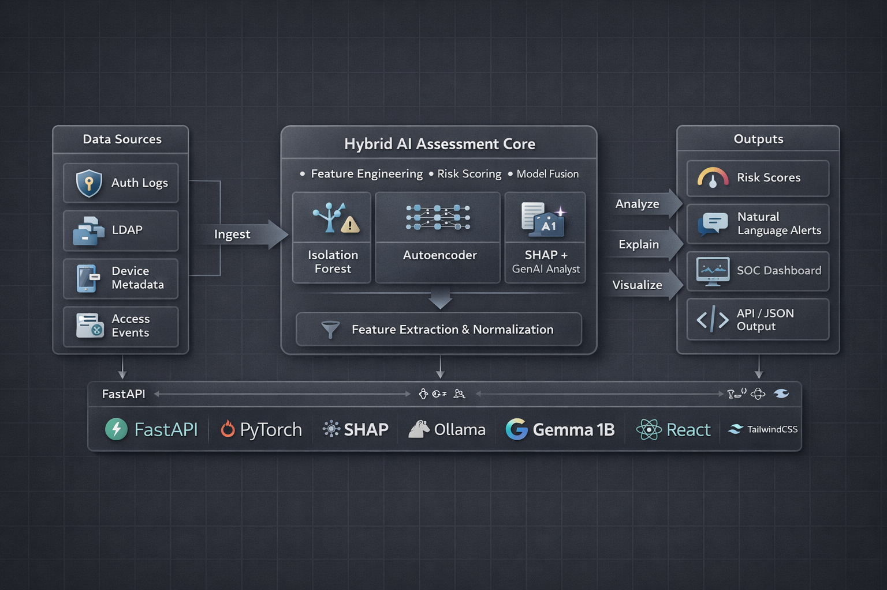
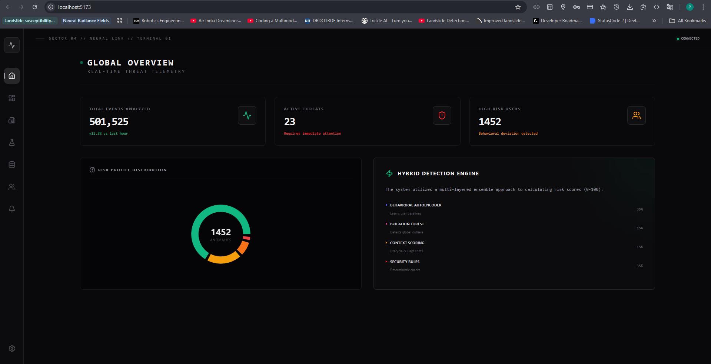
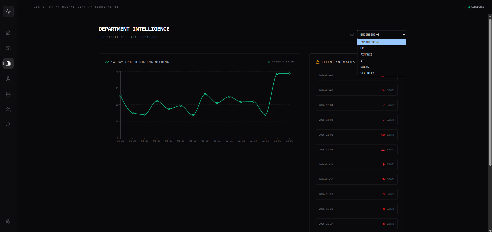
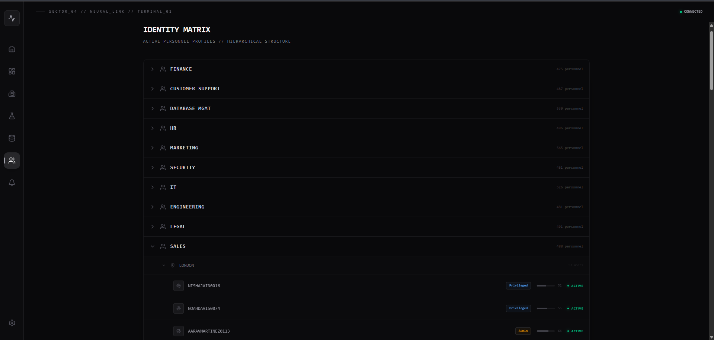

# 🛡️ Sentinel UEBA: Advanced Insider Threat Detection

**Sentinel** is a next-generation security platform that uses Artificial Intelligence to detect "Insider Threats"—employees who may be compromising company data, either maliciously or accidentally.

Unlike traditional security tools that just look for known bad files (viruses), Sentinel learns **behavior**. It watches how people normally work and spots when they start acting strangely.

> **For the Executive:** Think of it as a digital immune system. It learns what "healthy" looks like for every employee and alerts you instantly when it detects a "symptom" of a breach, explaining the issue in plain English.

---

## 🏗️ How It Works: The Core Intelligence

Sentinel doesn't rely on just one algorithm. It uses a **Hybrid AI Ensemble**—a team of three different AI models working together to catch what others miss.

### 1. The "Whistleblower" (Isolation Forest)
**Concept:** Imagine a crowded room. Most people are standing in groups talking. One person is standing alone in the corner wearing a mask. You spot them immediately because they are *isolated* from the norm.

*   **For the Non-AI Person:** This model looks at the entire company's data and identifies actions that are mathematically rare. If 4,999 employees log in from New York and one logs in from North Korea, this model flags it.
*   **For the AI Engineer:** We utilize an **Isolation Forest**, an unsupervised algorithm that explicitly isolates anomalies rather than profiling normal points. It constructs an ensemble of random decision trees. Anomalies (rare events) have shorter path lengths in these trees because they are easier to separate from the dense clusters of normal data. We use this for **global outlier detection**.

### 2. The "Psychologist" (Behavioral Autoencoder)
**Concept:** Your spouse knows your habits. If you suddenly buy flowers on a Tuesday when you usually only buy them on anniversaries, they know something is up. They aren't comparing you to *other people*; they are comparing you to *yourself*.

*   **For the Non-AI Person:** This model learning the unique "heartbeat" of every single user. It knows that "User A usually works 9-5 and accesses Finance folders." If User A suddenly logs in at 3 AM and accesses Engineering blueprints, this model triggers an alarm, even if other people do that all the time.
*   **For the AI Engineer:** We deploy a **Deep Autoencoder** (PyTorch). The network is trained to compress the user's login feature vector into a lower-dimensional latent space and then reconstruct it.
    *   **Training:** It minimizes the reconstruction error (MSE) on "normal" data.
    *   **Inference:** When an anomalous vector is fed in, the network fails to reconstruct it accurately, resulting in a **high reconstruction error**. This error magnitude becomes our "Anomaly Score."

### 3. The "Analyst" (GenAI & SHAP)
**Concept:** Getting a risk score of "95/100" is scary but useless if you don't know *why*. This component is like a human analyst standing over your shoulder, explaining the math.

*   **For the Non-AI Person:** Instead of showing you a confusing chart, Sentinel reads the data and reports: *"High Risk detected: User Steve is logging in from an unusual location (Russia) at an odd hour (3 AM), which is very different from his normal behavior."*
*   **For the AI Engineer:** We use **SHAP (SHapley Additive exPlanations)** to extract the contribution of each feature to the total anomaly score. These SHAP values tell us *which* factors (e.g., `location`, `time`, `device`) drove the score up. We then feed these top features and user context into a local **LLM (Gemma3:1B)** via a rigorously engineered prompt. The LLM translates the SHAP feature importance into a coherent, SOC-style narrative.

---

## 🖼️ Architecture & Flow

### System Tech Stack

*(3D Architecture Visual Placeholder - Awaiting Asset)*

### Data Pipeline Sequence

*(Sequence Flow Placeholder - Awaiting Asset)*

---

## 📸 Operational Interface

### GLOBAL OPERATIONS CENTER (`/landing`)

**The Command Deck.** A real-time telemetry view showing the pulse of the organization. It tracks active threats, risk velocity, and system health in a single pane of glass.

### DEPARTMENTAL INTELLIGENCE (`/dept`)

**The Drill-Down.** A view for investigating specific organizational units. It differentiates between a "Finance" team risk pattern and an "Engineering" team risk pattern.

### IDENTITY MATRIX (`/identities`)

**The Roster.** A hierarchical breakdown of every identity in the system, color-coded by their real-time trust score.

---

## 🚀 Getting Started

### Prerequisites
*   **Python 3.10+** (Backend)
*   **Node.js 18+** (Frontend)
*   **Ollama** (for the AI Analyst)

### 1. Install & Run Intelligence Engine (Backend)
The backend is powered by **FastAPI** and **PyTorch**.
```bash
cd backend/api
pip install -r requirements.txt
uvicorn main:app --host 0.0.0.0 --port 8000 --reload
```
*Note: On first run, it will automatically check for the Gemma3 model via Ollama.*

### 2. Install & Run Command Interface (Frontend)
The frontend is built with **React, Vite, and TailwindCSS**.
```bash
cd frontend
npm install
npm run dev
```

### 3. Generate Data (Optional)
To test the system at scale (1 Million Events), use the synthetic data generator:
```bash
python backend/scripts/generate_auth_data.py
```

---

## 🧭 Roadmap
*   [ ] **Graph Neural Networks (GNN)** for detecting lateral movement circles.
*   [ ] **Reinforcement Learning (RLHF)** to let analysts "upvote/downvote" alerts to retrain the model.
*   [ ] **Honey-Token Integration** to trap attackers who access fake files.
