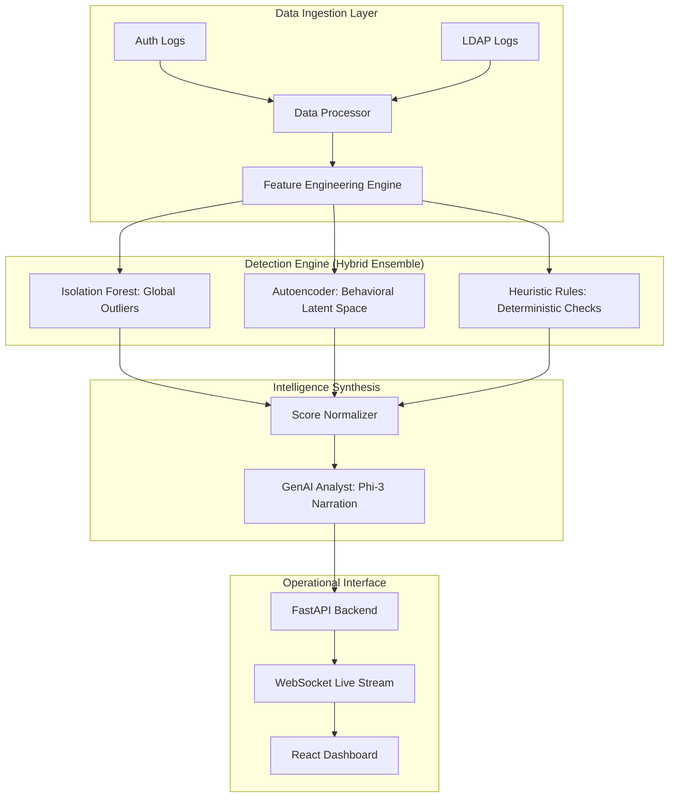
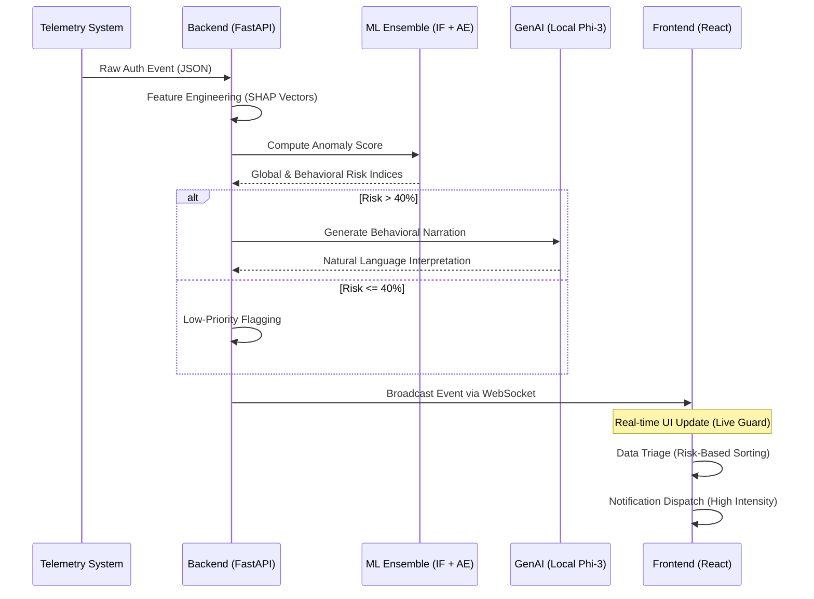

# 🛡️ Sentinel UEBA: Advanced Multi-Model Insider Threat Detection

Sentinel is a high-fidelity **User and Entity Behavior Analytics (UEBA)** platform designed to detect subtle, sophisticated insider threats within enterprise environments. By combining deep learning, statistical ensembles, and GenAI, Sentinel transforms raw telemetry into actionable, high-context intelligence.

---

## 🏗️ High-Level Architecture

Sentinel employs a modular architecture designed for horizontal scalability and high-throughput real-time analysis.



---

## 🔄 Process Flow & Sequence

The lifecycle of an event from raw telemetry to analyst notification follows a strict pipeline of scoring and narration.



---

## 🔬 Core Methodology

### 1. Hybrid Intelligence Model
- **Isolation Forest (Global)**: Analyzes the entire dataset to find "rare" events that stand out statistically across the whole company.
- **Deep Autoencoder (Behavioral)**: Learns the "normal" manifold of an individual user. If a user's behavior changes relative to their own past (even if it's statistically "normal" for the company), the latent space reconstruction error spikes.
- **Heuristic Rules**: Deterministic safety checks like *Impossible Travel* and *Known-Malicious Geo-Vectors*.

### 2. GenAI "Interpretive" Layer
While traditional ML gives you a score, Sentinel's **GenAI Analyst** (running local Phi-3) explains *why* the score is high. It examines the SHAP attribution coefficients and translates mathematical anomalies into human-readable narratives.

### 3. Real-time Triage (Notification Center)
The dashboard features a **Risk-Partitioned Queue**:
- **Nominal Feed**: Low-risk telemetry for operational awareness.
- **Anomalous Feed**: High-risk, escalated threats requiring immediate human intervention.

---

## 🛠️ Tech Stack

| Component | Technology |
| :--- | :--- |
| **Frontend** | React, TailwindCSS, Recharts, Lucide-React |
| **Backend** | FastAPI, Uvicorn, Websockets |
| **AI/ML** | PyTorch, Scikit-Learn, SHAP, Pandas |
| **LLM** | Ollama (Gemma3:1B) |
| **Styling** | Vanilla CSS, Glassmorphism, Neon/Red Accents |

---

## 🚀 Getting Started

### Prerequisites:
- Python 3.10+
- Node.js & NPM
- **Ollama** (Required for interpretive AI narratives)
- **Gemma3:1B** (Local LLM, 815MB footprint)

### Installation:

1. **Ollama Setup**:
   Download and install Ollama from [ollama.com](https://ollama.com/). The Sentinel backend is designed to be self-healing and will attempt to start the Ollama service on `localhost:11434` and pull the required `gemma3:1b` model automatically on its first run.
   
   However, for the best experience, we recommend a manual pull first:
   ```bash
   ollama pull gemma3:1b
   ```

2. **Initialize Backend**:
   ```bash
   cd backend
   pip install -r requirements.txt
   ```

3. **Initialize Frontend**:
   ```bash
   cd ../frontend
   npm install
   ```

## 🚀 Running the Engines

1. **Launch Backend**:
   From `backend/api`:
   ```bash
   uvicorn main:app --reload
   ```
   *Note: On first boot, the backend may pause for a few seconds to verify the local LLM connection.*

2. **Launch Frontend**:
   From `frontend`:
   ```bash
   npm run dev
   ```

---

## 🧭 Future Roadmap
- [ ] **Graph Neural Networks (GNN)**: For lateral movement detection across identity clusters.
- [ ] **Active Learning**: Automated model fine-tuning based on analyst feedback (Escalate/Resolve).
- [ ] **Multi-Agent Simulation**: Simulating red-team attacks to battle-test detection thresholds.
